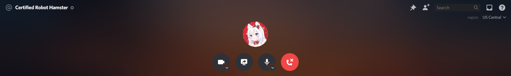

# Call Background
Customize the voice chat background with ease.



# Applying the Snippet
There are multiple ways that you can apply this snippet. You can either go to `./src/index.css`, or if you're lazy you can install it normally as if it's a theme.

### Installation
For **[Powercord](https://powercord.dev/)** or **[Vizality](https://vizality.com/)** installation, go to **Themes -> Open CMD / Powershell / Terminal / Gitbash**, and enter the following:
```
git clone https://github.com/Snippets-For-Discord/Call-Background
```

**For BetterDiscord:**
- [Direct Download](https://betterdiscord.net/ghdl?id=3494)
- [View Source](https://raw.githack.com/Snippets-For-Discord/Call-Background/main/src/support/CallBackground.theme.css)

**For Browser / Web:**
1. Install the Stylus extension for [Chrome](https://chrome.google.com/webstore/detail/stylus/clngdbkpkpeebahjckkjfobafhncgmne) / [Firefox](https://addons.mozilla.org/en-US/firefox/addon/styl-us/) / [Opera](https://github.com/openstyles/stylus/wiki/Opera,-Outdated-Stylus).
2. After installing, head over to [this link](https://raw.githack.com/Snippets-For-Discord/Call-Background/main/src/support/CallBackground.user.css).
3. Press the "Install Style" button.